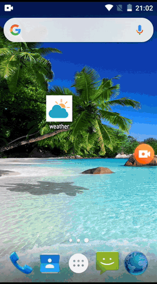
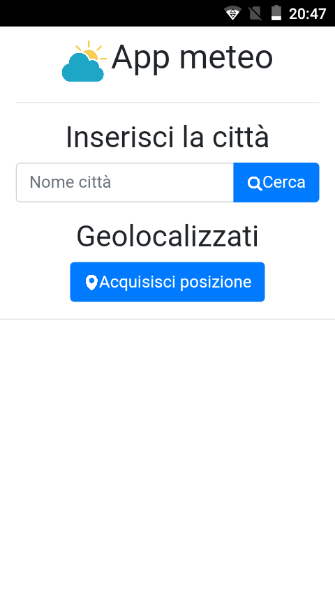
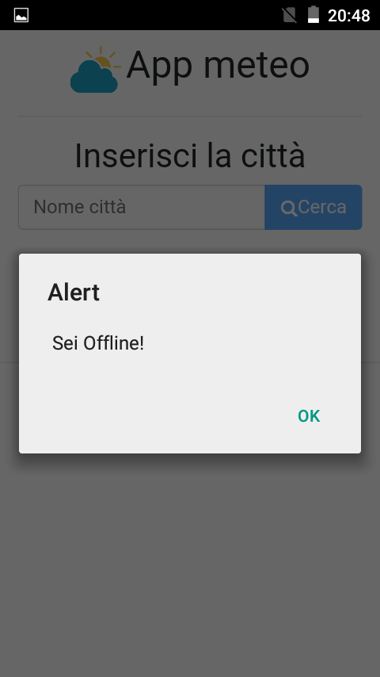
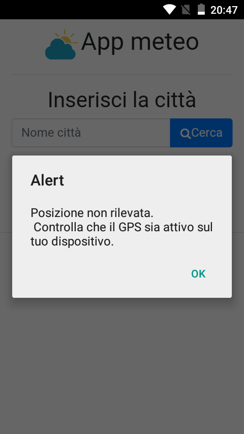

# App-weather
Android application to forecast weather 

<h2>Introduction </h2>
This is a simple weather app. 
Through this application you can use geolocalization signal to find your position and detect weather in your city, you can also write your city name in the search label.
Weather forecast is detected thanks to APIs of openweather.org. Link https://openweathermap.org/

<h2>Description </h2>
I realized this app with PhoneGap. I used geolocalization  and connection status plugin by Apache Cordova.
All data for weather forecast is loaded through URL.The data result is formatted in XML. To display xml result i used AJAX and JQuery to allow loading asyncronus resources and to allow an navigation more fluid.

There are two controls:

- First of all app check data connection: if device is not connected (WIFI or data), it will open alert popup and buttons will be diasbled, if the connection is reactivated the buttons will be reactivated again automatically. 
- If geo signal is disabled and user press on geolocalization button app will notice that user should active geo signal.

To try apk file https://github.com/marcodondo97/App-weather/tree/master/ApkFile

<h2> Images </h2>

Demonstration of use

Main page

Check connection data

Check geolocalization signal active

